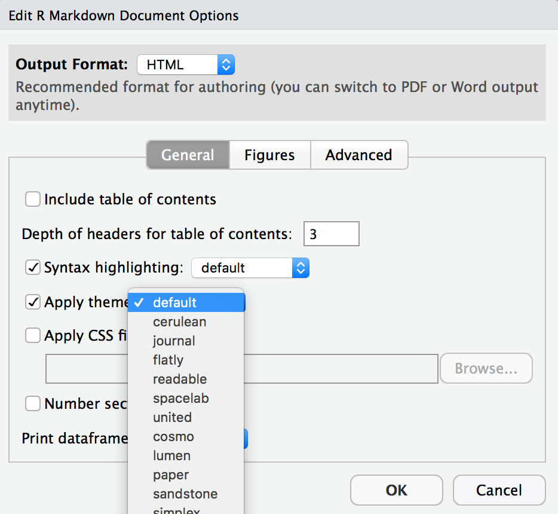

# Getting started

- [Install RStudio](https://www.rstudio.com/products/rstudio/download/#download)
- Open RStudio and install the `usethis` package by running the following code in the Console

```
install.packages("usethis")
```

- Install Git. Have Windows? [Use these instructions](https://happygitwithr.com/install-git.html#install-git-windows) Have a Mac? [Do this](https://happygitwithr.com/install-git.html#macos)
- Introduce yourself to git. Run this, substituting in your name and email address.

```{r, eval = FALSE}
library(usethis)
use_git_config(user.name = "Jane Doe", user.email = "jane@example.org")
git_default_branch_configure()
```

- Create credentials. Run the following

```{r, eval = FALSE}
create_github_token()
```

- Copy your PAT and then run the following and paste it when prompted.

```{r, eval = FALSE}
gitcreds::gitcreds_set()
```

- Clone the repository 

- Go to our class's GitHub organization [sta-679-s22](https://github.com/sta-679-s22)
- Find the GitHub repository (which we'll refer to as "repo" going forward) for this lab, `lab-00-tech-setup-YOUR-GITHUB-HANDLE`. This repo contains a template you can build on to complete your assignment.

```{r clone-repo-link, fig.margin = TRUE, echo = FALSE, fig.width=3}
knitr::include_graphics("img/01/clone-repo-link.png")
```

- On GitHub, click on the green **Clone or download** button, select **Use HTTPS** (this might already be selected by default, and if it is, you'll see the text **Clone with HTTPS** as in the image below). Click on the clipboard icon to copy the repo URL.

```{r new-project-from-gh, fig.margin = TRUE, echo = FALSE, fig.width=3}
knitr::include_graphics("img/01/new-project-from-gh.png")
```

- Go to RStudio Click File > New Project > Version Control > Git. In "Repository URL", paste the URL of your GitHub repository. It will be something like `https://github.com/LucyMcGowan/myrepo.git`.

# Packages

In this lab we will work with one package: `tidyverse` which is a collection of packages for doing data analysis in a "tidy" way.

Install this package by running the following in the console.

```{r eval = FALSE}
install.packages("tidyverse")
```

Now that the necessary package is installed, you should be able to Knit your document and see the results.

If you'd like to run your code in the Console as well you'll also need to load the package there. To do so, run the following in the console. 

```{r eval = TRUE, message = FALSE, warning = FALSE}
library(tidyverse) 
```

Note that the package is also loaded with the same commands in your R Markdown document.

# Warm up

Before we introduce the data, let's warm up with some simple exercises. 


```{marginfigure}
The top portion of your R Markdown file (between the three dashed lines) is called YAML. It stands for "YAML Ain't Markup Language". It is a human friendly data serialization standard for all programming languages. All you need to know is that this area is called the YAML (we will refer to it as such) and that it contains meta information about your document.
```

## YAML: 

Open the R Markdown (Rmd) file in your project, change the author name to your name, and knit the document.

```{r yaml-raw-to-rendered, fig.fullwidth=TRUE, echo = FALSE}
knitr::include_graphics("img/01/yaml-raw-to-rendered.png")
```

## Commiting changes:

Then Go to the Git pane in your RStudio.

If you have made changes to your Rmd file, you should see it listed here. Click on it to select it in this list and then click on **Diff**. This shows you the *diff*erence between the last committed state of the document and its current state that includes your changes. If you're happy with these changes, write "Update author name" in the **Commit message** box and hit **Commit**.

```{r update-author-name-commit, fig.fullwidth=TRUE, echo = FALSE}
knitr::include_graphics("img/01/update-author-name-commit.png")
```

You don't have to commit after every change, this would get quite cumbersome. You should consider committing states that are *meaningful to you* for inspection, comparison, or restoration. In the first few assignments we will tell you exactly when to commit and in some cases, what commit message to use. As the semester progresses we will let you make these decisions.

## Pushing changes: 

Now that you have made an update and committed this change, it's time to push these changes to the web! Or more specifically, to your repo on GitHub. Why? So that others can see your changes. And by others, I mean me (your repos in this course are private to you and me, only). 

In order to push your changes to GitHub, click on **Push**. 

# Data

Today we are going to read in some real data and create a figure. This data and code was generously provided by [Blythe Anderson] on GitHub.

1. Copy the following line of code to read in the following data and save it as an object called `discordant_data`. Add your responses to your lab report. When you're done, commit your changes with the commit message "Added answer for Ex 1", and push.

```{r}
discordant_data <- read_csv(
  "https://raw.githubusercontent.com/blythejane/covid_safety/c92a4c60a83e67179202fafdf89858c6bafaaa7e/discordant_data.csv"
)
```


```{marginfigure}
This dataset contains information about the sensitivity of nasal rapid antigen tests compared to saliva PCR tests, as detailed in [this recent article](https://www.medrxiv.org/content/10.1101/2022.01.04.22268770v1).
```

# Data visualization

Below is the code you will need to complete this exercise. Basically, the answer is already given, but you need to include relevant bits in your Rmd document and successfully knit it and view the results. Be sure to write a full sentence with the answer to the question (i.e. From this figure we learn...), do not _only_ output the R code.


```{marginfigure}
"CT stands for “Cycle Threshold” and indicates how many times a machine needed to try to copy a particular virus’s genetic material before being able to detect that material on a particular test called a Polymerase Chain Reaction (PCR) test. The CT value can be looked at as an indirect indicator of the amount of viral genetic material detected from a particular specimen on a particular test at a particular time. In general, a lower CT value indicates a higher viral load in that specimen, and a higher CT value indicates a lower viral load." [from Santa Clara County Public Health](https://publichealthproviders.sccgov.org/sites/g/files/exjcpb951/files/Documents/FAQs-CT-values-from-covid-19-PCR-tests.pdf)
```

2. Add the following code to your .Rmd file to create a Figure. On the x-axis, we have days since the first positive saliva PCR test. On the y-axis we have Ct value. The points indicate whether a nasal rapid antigen test given at the same time was positive (a true positive, blue), negative (a false negative, red). What can you learn from this plot? Thinking about the assumptions we discussed last class, what other information might be helpful to draw conclusions?

```{r}
discordant_data <- discordant_data %>%
  filter(!is.na(day), !is.na(ct_saliva))

ag_discordant <- discordant_data %>% 
  filter(antigen == "Negative")
ag_concordant <- discordant_data %>% 
  filter(antigen == "Positive")
ag_missing <- discordant_data %>% 
  filter(is.na(antigen))

ggplot(discordant_data, aes(day, ct_saliva)) +
  geom_line(aes(group = case), 
            alpha = 0.8,
            size = 0.6,
            color = "grey55") +
  geom_point(data = ag_missing, 
             aes(day, ct_saliva, color = "Not Performed"),
             size = 1) +
  geom_point(data = ag_concordant,
             aes(day, ct_saliva, color = "True Positive"),
             alpha = 0.5,
             size = 4) +
  geom_point(data = ag_discordant, 
             aes(day, ct_saliva, color = "False Negative"),
             alpha = 0.5,
             size = 4) +
  scale_x_continuous("Days from first positive test",
                     breaks = c(0, 2, 4, 6, 8, 10)) +
  scale_y_reverse("Saliva SARS-CoV-2 PCR Ct") +
  scale_color_manual(values = c("False Negative" = "orangered3", 
                                "True Positive" = "royalblue",
                                "Not Performed" = "grey55"),
                     name = "Nasal Antigen Test") +
  coord_cartesian(ylim = c(38, 10), xlim = c(0, 10)) + 
  theme_bw() 
```


*This is another good place to pause, commit changes with the commit message "Added answer for Ex 2", and push.*

You're done with the data analysis exercises, but we'd like you to do two more things:

```{r fig-resize-global, fig.margin = TRUE, echo = FALSE, fig.width=3}
knitr::include_graphics("img/01/fig-resize-global.png")
```

- **Resize your figures:** 

Click on the gear icon in on top of the R Markdown document, and select "Output Options..." in the dropdown menu. In the pop up dialogue box go to the Figures tab and change the height and width of the figures, and hit OK when done. Then, knit your document and see how you like the new sizes. Change and knit again and again until you're happy with the figure sizes. Note that these values get saved in the YAML.

```{r fig-resize-local, fig.margin = TRUE, echo = FALSE, fig.width=3}
knitr::include_graphics("img/01/fig-resize-local.png")
```

You can also use different figure sizes for differen figures. To do so click on the gear icon within the chunk where you want to make a change. Changing the figure sizes added new options to these chunks: `fig.width` and `fig.height`. You can change them by defining different values directly in your R Markdown document as well.

```{r theme-highlight, fig.margin = TRUE, echo = FALSE, fig.width=3}

```

- **Change the look of your report:** 

Once again click on the gear icon in on top of the R Markdown document, and select "Output Options..." in the dropdown menu. In the General tab of the pop up dialogue box try out different Syntax highlighting and theme options. Hit OK and knit your document to see how it looks. Play around with these until you're happy with the look.

<br>

```{marginfigure}
Not sure how to use emojis on your computer? Maybe a teammate can help? Or you can ask your TA as well!
  ```

*Yay, you're done! Commit all remaining changes, use the commit message "Done with Lab 1! `r emo::ji("muscle")`", and push. Before you wrap up the assignment, make sure all documents are updated on your GitHub repo.*


<br><br><br>
 </img> Lab adapted from <a href="https://datasciencebox.org" target="_blank">datasciencebox.org</a> by Dr. Lucy D'Agostino McGowan


