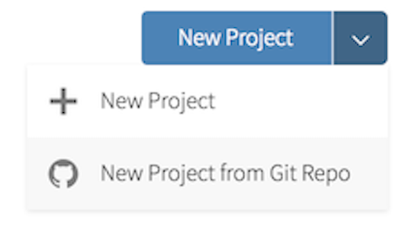

# Getting Started

- Clone the repository 

- Go to our class's GitHub organization [sta-679-s22](https://github.com/sta-679-s22)
- Find the GitHub repository (which we'll refer to as "repo" going forward) for this lab, `lab-01-causal-diagrams-YOUR-GITHUB-HANDLE`. This repo contains a template you can build on to complete your assignment.

```{r clone-repo-link, fig.margin = TRUE, echo = FALSE, fig.width=3}
knitr::include_graphics("img/01/clone-repo-link.png")
```

- On GitHub, click on the green **Clone or download** button, select **Use HTTPS** (this might already be selected by default, and if it is, you'll see the text **Clone with HTTPS** as in the image below). Click on the clipboard icon to copy the repo URL.

```{r new-project-from-gh, fig.margin = TRUE, echo = FALSE, fig.width=3}

```

- Go to RStudio Click File > New Project > Version Control > Git. In "Repository URL", paste the URL of your GitHub repository. It will be something like `https://github.com/LucyMcGowan/myrepo.git`.

# Packages

In this lab we will work with two packages: `tidyverse` which is a collection of packages for doing data analysis in a "tidy" way and `ggdag`, a pacakge to create causal diagrams.

Install this package by running the following in the console.

```{r eval = FALSE}
install.packages("tidyverse")
install.packages("ggdag")
```

Now that the necessary package is installed, you should be able to Knit your document and see the results.

If you'd like to run your code in the Console as well you'll also need to load the package there. To do so, run the following in the console. 

```{r eval = TRUE, message = FALSE, warning = FALSE}
library(tidyverse) 
library(ggdag)
```

Note that the package is also loaded with the same commands in your R Markdown document.

# Warm up

Before we introduce the data, let's warm up with some simple exercises. 


```{marginfigure}
The top portion of your R Markdown file (between the three dashed lines) is called YAML. It stands for "YAML Ain't Markup Language". It is a human friendly data serialization standard for all programming languages. All you need to know is that this area is called the YAML (we will refer to it as such) and that it contains meta information about your document.
```

## YAML: 

Open the R Markdown (Rmd) file in your project, change the author name to your name, and knit the document.

```{r yaml-raw-to-rendered, fig.fullwidth=TRUE, echo = FALSE}
knitr::include_graphics("img/01/yaml-raw-to-rendered.png")
```

## Commiting changes:

Then Go to the Git pane in your RStudio.

If you have made changes to your Rmd file, you should see it listed here. Click on it to select it in this list and then click on **Diff**. This shows you the *diff*erence between the last committed state of the document and its current state that includes your changes. If you're happy with these changes, write "Update author name" in the **Commit message** box and hit **Commit**.

```{r update-author-name-commit, fig.fullwidth=TRUE, echo = FALSE}
knitr::include_graphics("img/01/update-author-name-commit.png")
```

You don't have to commit after every change, this would get quite cumbersome. You should consider committing states that are *meaningful to you* for inspection, comparison, or restoration. In the first few assignments we will tell you exactly when to commit and in some cases, what commit message to use. As the semester progresses we will let you make these decisions.

## Pushing changes: 

Now that you have made an update and committed this change, it's time to push these changes to the web! Or more specifically, to your repo on GitHub. Why? So that others can see your changes. And by others, I mean me (your repos in this course are private to you and me, only). 

In order to push your changes to GitHub, click on **Push**. 

# Exercises

1. Descriptively, drinking coffee is associated with lung cancer. Does drinking coffee cause lung cancer? We are going to build causal diagrams to help think about this question. To start, add to the formulas below to identify factors that make someone more/less likely to have lung cancer, factors that make someone more/less likely to drink coffee, or any additional relationships between variables present. 

`cancer ~ smoking`  
`smoking ~ addictive_behavior`  
`coffee ~ addictive_behavior`  

2. We are going to create a causal diagram using the assumptions in Exercise 1. Specify a directed acyclic graph (DAG) with `dagify()`. Plot the causal diagram using `ggdag()`.

3. Underneath the hood, `ggdag()` calls the `tidy_dagitty()` function on `dagitty` objects. Check the help page for `?tidy_dagitty()` and try using one of the layouts listed in `?ggraph::layout_tbl_graph_igraph()`. Experiment with different layouts. Plot them with `ggdag()`

4. We are assuming that coffee does *not* cause lung cancer. In causal diagram terminology, we want to know if these two factors are *D-connected* (as in, directionally connected). Since we are assuming that there's no causal relationship, any D-connection is caused by other factors. Try `ggdag_dconnected()` to see if we coffee and lung cancer are D-connected.

5.  Use the `ggdag_paths()` function to plot the open paths on your DAG. Remember, since we assume there is *no* causal path from coffee to lung cancer, any open paths must be confounding pathways. 

6. Objects created with the {ggdag} package are just ggplots! You can add themes, geoms, and other {ggplot2} elements with `+` like a normal ggplot. Try adding a theme ({ggdag} has several, or you could try `theme_void()`).

7. The variable names are a little hard to read. So let's specify some labels. In the tidy DAG, these are called `label`. In `ggdag_paths()`, add the argument `use_labels = "label"` and remove the node text with `text = FALSE`.

Here is some example code to specify labels:

```{r, eval = FALSE}
coffee_cancer_dag <- dagify(
  cancer ~ smoking,
  smoking ~ addictive,
  coffee ~ addictive,
  exposure = "coffee",
  outcome = "cancer",
  labels = c(
    "coffee" = "Coffee", 
    "cancer" = "Lung Cancer", 
    "smoking" = "Smoking", 
    "addictive" = "Addictive \nBehavior"
  )
)
```


8. Now that we know the open, confounding pathways (sometimes called "backdoor paths"), we need to know how to close them! First, we'll ask {ggdag} for adjustment sets, then we would need to do something in our analysis to account for at least one adjustment set (e.g. multivariable regression, weighting, or matching for the adjustment sets). Use `ggdag_adjustment_set()` to visualize the adjustment sets. Add the arguments `use_labels = "label"` and `text = FALSE`.

9. Write an R formula for each adjustment set, as you might if you were fitting a model in `lm()` or `glm()`.

10. Sometimes, we know a variable plays a vital role in a causal diagram but we can't measure it, or we simply don't have it in our data set. You can tell {ggdag} that a variable is unmeasured with the `latent` argument in `dagify()`. Re-run the `dagify()` call above, but set `latent = "addictive"` (meaning we can't or haven't measured this variable). Plot it with `ggdag_adjustment_set()`. What's different? Now, try setting `latent = c("addictive", "smoking")` and plotting the adjustment set. What do the results mean?

11. Find a research article that speculates about a causal relationship. Draw the causal diagram for the study. Describe whether the study appropriately adjusted for the potential confounders present. 

If you are unsure where to find research articles, here are a few places to browse:

* Google Scholar https://scholar.google.com
* PLoS Medicine https://journals.plos.org/plosmedicine/issue


