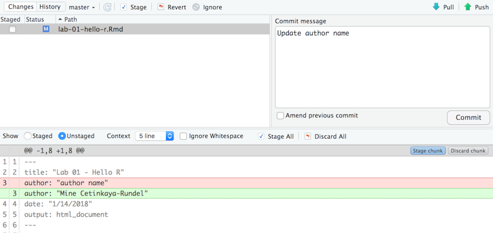

# Getting Started

- Clone the repository 

- Go to our class's GitHub organization [sta-679-s22](https://github.com/sta-679-s22)
- Find the GitHub repository (which we'll refer to as "repo" going forward) for this lab, `lab-02-propensity-scores-YOUR-GITHUB-HANDLE`. This repo contains a template you can build on to complete your assignment.

```{r clone-repo-link, fig.margin = TRUE, echo = FALSE, fig.width=3}
knitr::include_graphics("img/01/clone-repo-link.png")
```

- On GitHub, click on the green **Clone or download** button, select **Use HTTPS** (this might already be selected by default, and if it is, you'll see the text **Clone with HTTPS** as in the image below). Click on the clipboard icon to copy the repo URL.

```{r new-project-from-gh, fig.margin = TRUE, echo = FALSE, fig.width=3}
knitr::include_graphics("img/01/new-project-from-gh.png")
```

- Go to RStudio Click File > New Project > Version Control > Git. In "Repository URL", paste the URL of your GitHub repository. It will be something like `https://github.com/LucyMcGowan/myrepo.git`.

# Packages

In this lab we will work with two packages: `tidyverse` which is a collection of packages for doing data analysis in a "tidy" way and `ggdag`, a pacakge to create causal diagrams.

Install this package by running the following in the console.

```{r eval = FALSE}
install.packages("tidyverse")
install.packages("ggdag")
```

Now that the necessary package is installed, you should be able to Knit your document and see the results.

If you'd like to run your code in the Console as well you'll also need to load the package there. To do so, run the following in the console. 

```{r eval = TRUE, message = FALSE, warning = FALSE}
library(tidyverse) 
library(ggdag)
```

Note that the package is also loaded with the same commands in your R Markdown document.

# Warm up

Before we introduce the data, let's warm up with some simple exercises. 


```{marginfigure}
The top portion of your R Markdown file (between the three dashed lines) is called YAML. It stands for "YAML Ain't Markup Language". It is a human friendly data serialization standard for all programming languages. All you need to know is that this area is called the YAML (we will refer to it as such) and that it contains meta information about your document.
```

## YAML: 

Open the R Markdown (Rmd) file in your project, change the author name to your name, and knit the document.

```{r yaml-raw-to-rendered, fig.fullwidth=TRUE, echo = FALSE}
knitr::include_graphics("img/01/yaml-raw-to-rendered.png")
```

## Commiting changes:

Then Go to the Git pane in your RStudio.

If you have made changes to your Rmd file, you should see it listed here. Click on it to select it in this list and then click on **Diff**. This shows you the *diff*erence between the last committed state of the document and its current state that includes your changes. If you're happy with these changes, write "Update author name" in the **Commit message** box and hit **Commit**.

```{r update-author-name-commit, fig.fullwidth=TRUE, echo = FALSE}

```

You don't have to commit after every change, this would get quite cumbersome. You should consider committing states that are *meaningful to you* for inspection, comparison, or restoration. In the first few assignments we will tell you exactly when to commit and in some cases, what commit message to use. As the semester progresses we will let you make these decisions.

## Pushing changes: 

Now that you have made an update and committed this change, it's time to push these changes to the web! Or more specifically, to your repo on GitHub. Why? So that others can see your changes. And by others, I mean me (your repos in this course are private to you and me, only). 

In order to push your changes to GitHub, click on **Push**. 

# Exercises

You are interested in the relationship between whether a customer had a good experience with customer service and how much they spent at your store. 

1. To start, add to the formulas below to identify factors that make someone more/less likely to have had a good exerpeince with customer service, more/less likely to spend money at your store, or any additional relationships between variables present. 

2. Using the ggdag package, draw a causal diagram for the relationships described in the previous exercise. 

3. Determine the adjustment set(s) based on the causal diagram you drew in the previous exercise.

4. You have been given a data set with 1,265 observations that includes information about your customers. The exposure of interest is `satistified_customer_service` and the outcome of interest is `next_spend`. Read this data into your .Rmd file by copying the following code.

```{r, message = FALSE, warning = FALSE}
library(tidyverse)
customer_data <- read_csv("customer_satisfaction.csv")
```

5. Run the following code to "glimpse" at the data. What variables are there? Match the variables with any you included in your causal diagram and set the rest as "latent".

```{r, eval = FALSE}
glimpse(customer_data)
```

6. Based on the available variables, determine your adjustment set. Fit a propensity score model adjusting for these variables.

7. Use the `augment` function to add the propensity score to your data frame. 

8. Examine the distribution of propensity score between the two groups. Create a plot to show this. Make sure your plot is "presentation ready" (axis labels, clear legend description or labels to describe histograms, if histograms overlap too much make sure to mirror them, etc.) What do you notice? Describe the plot.