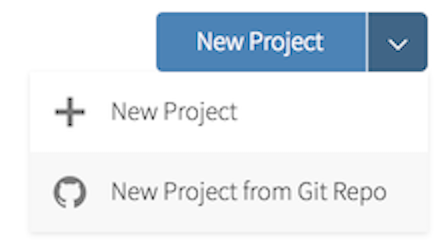

# Getting Started

- Clone the repository 

- Go to our class's GitHub organization [sta-679-s22](https://github.com/sta-679-s22)
- Find the GitHub repository (which we'll refer to as "repo" going forward) for this lab, `lab-04-whole-game-YOUR-GITHUB-HANDLE`. This repo contains a template you can build on to complete your assignment.

```{r clone-repo-link, fig.margin = TRUE, echo = FALSE, fig.width=3}
knitr::include_graphics("img/01/clone-repo-link.png")
```

- On GitHub, click on the green **Clone or download** button, select **Use HTTPS** (this might already be selected by default, and if it is, you'll see the text **Clone with HTTPS** as in the image below). Click on the clipboard icon to copy the repo URL.

```{r new-project-from-gh, fig.margin = TRUE, echo = FALSE, fig.width=3}

```

- Go to RStudio Click File > New Project > Version Control > Git. In "Repository URL", paste the URL of your GitHub repository. It will be something like `https://github.com/LucyMcGowan/myrepo.git`.

# Prompt

Using the `nhefs` dataset from the `causaldata` package, complete a full analysis estimating the causal effect of quitting smoking on a participants weight in 1982. Your analysis should include the following components:

- A clearly defined causal question, including an explanation of the estimand of interest (you may chose your own based on how you define your causal question)
- A proposed DAG 
- Appropriate handling of any missing data
- A propensity score model
- Appropriate Tables, Figures, etc to explain the population you are drawing inference on
- Appropriate checks for the propensity score model
- Appropriate incorporation of the propensity score in the outcome model, including uncertainty estimates
- An explanation of the effect
- A sensitivity analysis to unmeasured confounding

This should be written up as a report where you describe each step in words and what you found.